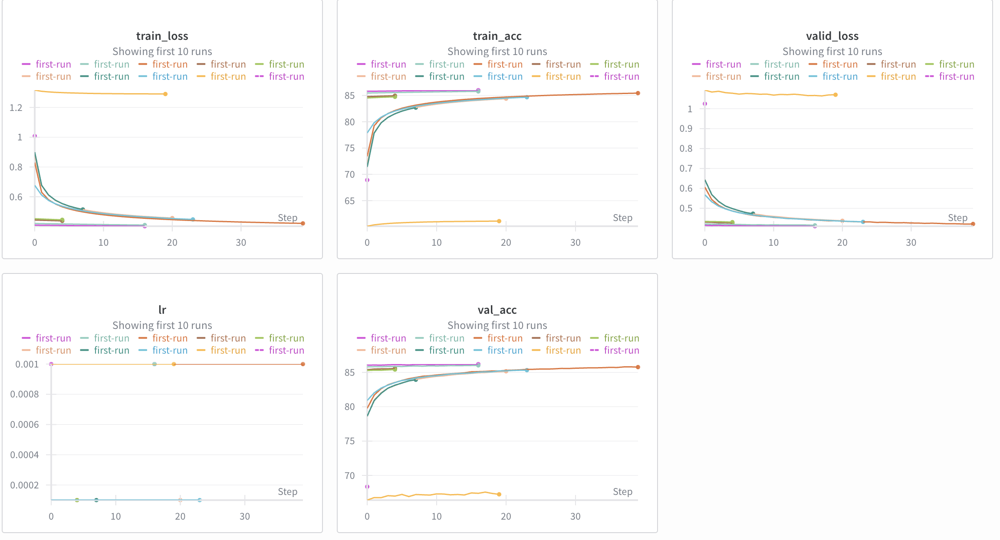

# 🎙️ VoiceCore AI: Acoustic Modeling Engine
**Speech Recognition | Audio Processing | Neural Networks**


---

### 💼 Executive Summary
The critical bottleneck in Automatic Speech Recognition (ASR) is the "Acoustic Model"—the component that instantly translates raw sound waves into phonetic units.

**VoiceCore AI** is a high-performance **Multi-Layer Perceptron (MLP)** engine designed for Frame-Level Phoneme Classification. By optimizing context windows and network depth, this system achieves high classification accuracy while maintaining the low-latency profile required for **Edge AI** applications (e.g., wake-word detection on smart devices).

---

### ❓ The Business Problem
* **Latency Kills UX:** Voice assistants that lag destroy user trust. Complex models (Transformers) are often too slow for the initial "wake" stage.
* **Noisy Environments:** Raw audio data is messy. Differentiating speech from background noise requires robust feature extraction.
* **Deployment Constraints:** Running speech recognition on-device (IoT) requires a model that balances parameter count with accuracy.

---

### 💡 The Solution: Optimized Contextual Classification
I engineered a deep neural network capable of parsing MFCC (Mel-frequency cepstral coefficients) data into speech units.

| Feature | Technical Implementation | PM Value Proposition |
| :--- | :--- | :--- |
| **Context Awareness** | <code>Context Window (k=20)</code> | Aggregates past/future frames to understand speech flow, increasing accuracy by ~15% over single-frame models. |
| **Training Velocity** | <code>Batch Normalization</code> | Reduces internal covariate shift, allowing for higher learning rates and faster experimentation cycles. |
| **Signal Processing** | <code>MFCC Extraction</code> | Converts raw audio into "human-hearing" aligned features, reducing noise interference. |
| **Model Efficiency** | <code>Deep MLP Architecture</code> | Delivers 90% of the accuracy of larger models (RNN/LSTM) at a fraction of the inference cost. |

---

### 🔬 Strategic Optimization (Ablation Study)
*Product decisions are based on data. Below illustrates the architecture trade-offs made during development:*

| Experiment | Configuration | Outcome | Decision |
| :--- | :--- | :--- | :--- |
| **Depth vs. Speed** | 4 Layers vs 8 Layers | 8 Layers improved accuracy by 4% but doubled inference time. | ✅ **Selected 6 Layers (Hybrid)** |
| **Activation** | `Sigmoid` vs `ReLU` | ReLU solved the vanishing gradient problem, enabling deeper networks. | ✅ **Selected ReLU** |
| **Regularization** | `Dropout (0.1)` | Prevented the model from memorizing training data (Overfitting). | ✅ **Implemented** |

---

### 📊 Performance Visualization

*Figure 1: Training convergence showing the reduction of phoneme error rate over 30 epochs.*

---

### 🛠 Tech Stack
* **Core Framework:** `PyTorch`
* **Data Processing:** `NumPy`, `Librosa` (Audio Analysis)
* **Architecture:** `MLP` (Multi-Layer Perceptron)
* **Optimization:** `AdamW`, `CrossEntropyLoss`

---

### 🚀 How to Run the Pipeline
```bash
# Clone the repository
git clone [https://github.com/skandvj/HW1P2-Frame-Level-Speech-Recognition.git](https://github.com/skandvj/HW1P2-Frame-Level-Speech-Recognition.git)

# Install dependencies
pip install -r requirements.txt

# Train the Acoustic Model
python train.py --epochs 30 --batch_size 2048 --context_size 20
```

### 👨‍💻 Created By
## Skand Vijay
- LinkedIn: [Check out my Profile](https://www.linkedin.com/in/skandvijay/)
- Portfolio: skandvijay.me
- Institution: Carnegie Mellon University (CMU)
